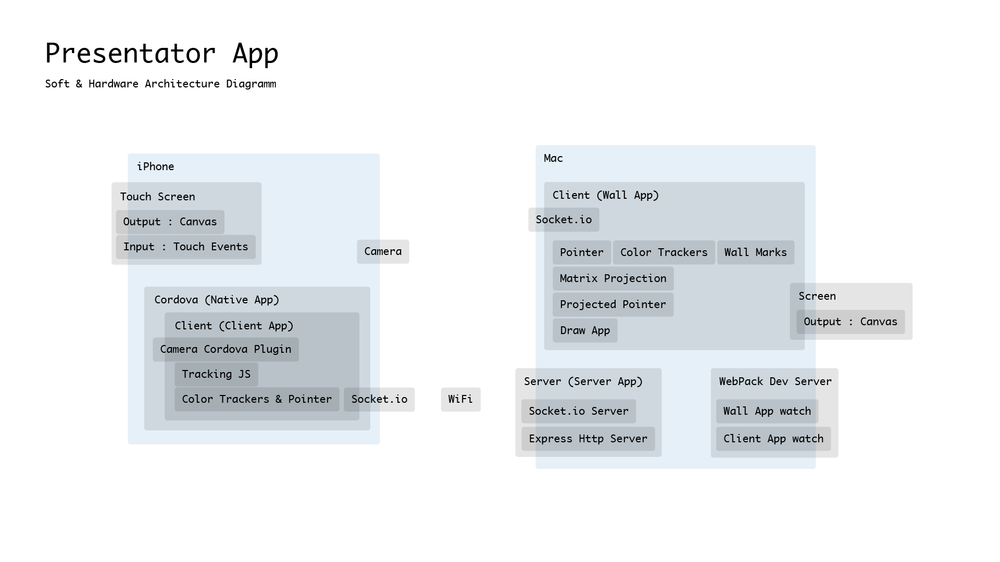

# Final Project MIS 

#### Names
- Erika Garces 118047
- Anton Kliuyeu 118026

#### File System Tree
- `./native/.` Cordova native iOS sandbox
	- `./native/www/index.html` Application loader
- `./server/index.js` server application with socket.io communication
	- `./server/www/`
		- `./sever/www/client/index.html` Client web-application for iPhone 7
		-  `./sever/www/wall/index.html` Wall canvas application

# Touch projector in JavaScript
## Summary of “Touch Projector: Mobile Interaction through Video”

The aim of the paper “Touch Projector: Mobile Interaction through Video” is based on 1992 Tani’s idea.  He proposed to remotely operate machines by manipulating a live video image on a screen. His project was implemented using cameras that observed industrial machinery and allowed users to manipulate switches and sliders over a distance. Boring revisited Tani´s metaphor, even though the environment and usage scenarios had drastically changed, the metaphor was still fascinating, and presented a system that enabled users to interact with screens through live video image but now using mobile devices.

Boring’s implementation consisted of a touch projector device; Apple Iphone 3G, multiple monitors and a server that controls all the interactions; all communication was over wireless LAN.  Monitors registered to the server and transferred their content. The server received updates from the monitors even if were done on a single display. All touch events received by the mobile device were also routed through the server. The position and orientation of the device were determined by transferring the camera stream to the server and analyzing the derivation of the relation from the perspective distortion gotten on the mobile device to the display.

## Our implementation
As mentioned before, our implementation was based on 2010 Boring’s system. The technology used in our implementation was JavaScript, NodeJS, NPM, Webpack, TrackingJS and Cordova.

The modules and libraries used in our implantation are as follow:

- https://github.com/antonkluev/fw.git, a self-made JavaScript framework dealing with DOM, containing math functions and other utilities that improved readability and development speed.
- https://github.com/VirtuoWorks/CanvasCameraPlugin.git, this plugin was utilized to translate the camera signal to canvas graphic.
- Express, this module was used to create a http server.
- Perspective-transform, JavaScript library that handled the perspective matrix calculation.
- Socket.io, real-time protocol that operated communication with the server.
- TrackingJS, JavaScript library used for image recognition. In our first implementation, it was applied the submodule feature descriptor which is based on SIFT algorithm. Color tracker was utilized on our second realization.
- Babel, Plugins that acts as compiler (transpiler) to work with the latest JavaScript through syntax transformers (es6 to es5) without waiting browser support.
- Webpack, is a web application manager. It runs on NodeJS with help of NMP, pulling all the application dependencies and packing them into one JavaScript blob.
- Cordova, native sandbox used to access native API through plugins. In our application, Cordova was required to access the camera parameters, screen rotation, status bar, iOS platform support, and so on.
- css-loader, file-loader, loader-utils, node-sass, sass-loader, style-loader and url-loader are modules used to transpile from SASS to CSS.
- Nodemon, ip and cross-env are utilities employed to improve development workflow.

## Cursor projection calculation
The cursor projection calculation was done by getting the perspective matrix from the wall (Monitor) and the distorted image from the mobile device. The Perspective-transform library functioned by inputting four coordinates from rectangle ‘A’, which were the rectangle corners, four coordinates from rectangle ‘B’; also corners, and a point coordinate that was placed on rectangle ‘A’ and outputted as a projected point on rectangle ‘B’ coordinate system.

## Implementation One
Our implementation consisted also of three main elements as Boring´s system; a touch projector device, Apple Iphone 7 (client software), a monitor with an image (wall software) and a server (server software). First, we tried to find same features between original wall canvas and the captured footage from the mobile device to make the image recognition scalable, rotation and translation invariant. Since iPhone was not powerful enough to process descriptors with a reliable speed and sent them via wireless network, the whole video stream was sent to the server and processed in there. Additionally, TrackingJS; image recognition library, only ran on the client side, therefore, the video signal was transferred via server to the wall software. 

On the wall software ran the feature descriptor method that extracted point of interest from the incoming client video signal and original canvas graphics. Afterwards, the coordinates of features from the client side were evenly divided into four sectors. In each sector a mean value was calculated and used as a corner to recreate a rectangle. Likewise, the coordinates of features from the wall were evenly divided, and a mean value was calculated, too. After this process was completed, the client pointer was successfully projected by creating a perspective matrix built from the four generated “distorted” client vectors and “undistorted” wall vectors. 

Unfortunately, using feature descriptor from TrackingJS created wrong perspective calculation from points of interest outliers; as a result, the cursor got a lot of noise, and the interaction was not feasible. A solution to this problem could have been to increase the quality of the client streamed video using a very efficient peer to peer webRTC video streaming technology that is not fully supported yet, and remove the outliers with very complex mathematical procedures.

## Implementation two
Our second attempt was successfully implemented, it used the same three main components as our first application; mobile device (client software), monitor (wall software) and sever (server software). In this implementation, the image processing was done on the mobile device using TrackingJS color tracker that is more efficient than the descriptor search. In this effort, the mobile analyzed the video signal and sent only four coordinates of the recognized color marks to the wall software through the server. In this implementation, the image perspective calculation was still done on the monitor, and the server was still only used as a communication socket. With this straightforward solution, the system interaction was highly usable and had very low latency. 

## Architecture diagram

## Video 
+ [Youtube video](https://youtu.be/kon_MH0BWLg)

## Reference:
1.	Boring, S., Baur D., Butz A., Gustafson, S., Baudisch , P. (2010), Touch Projector: Mobile Interaction through Video. Proc CHI 2010, 2287- 2296
2.	Tani, M., Yamaashi, K., Tanikoshi, K., Futakawa, M., and Tanifuji, S. (1992). Object-oriented video: interaction with real-world objects through live video. Proc. CHI 1992, 593–598. 
